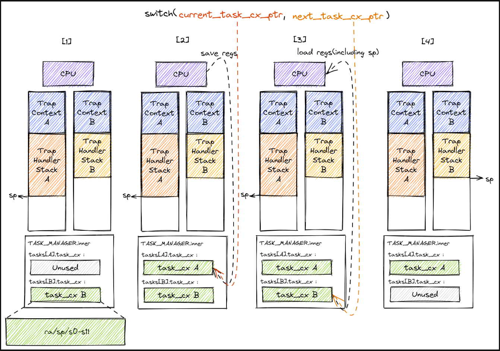

# 多道批处理系统  
  
## 多个程序是怎么被加载的？  
  
  批处理系统是将多个应用打包加载放置到内存的一段区域，这里具体来说就是一段连续的物理地址，
  根据 app/task 的序号连续的放置。
```rust
# /os/loader.rs
/// Load nth user app at
/// [APP_BASE_ADDRESS + n * APP_SIZE_LIMIT, APP_BASE_ADDRESS + (n+1) * APP_SIZE_LIMIT).
pub fn load_apps() {
    extern "C" {
        fn _num_app();
    }
    let num_app_ptr = _num_app as usize as *const usize;
    let num_app = get_num_app();
    let app_start = unsafe { core::slice::from_raw_parts(num_app_ptr.add(1), num_app + 1) };
    // clear i-cache first
    unsafe {
        asm!("fence.i");
    }
    // load apps
    for i in 0..num_app {
        let base_i = get_base_i(i);
        // clear region
        (base_i..base_i + APP_SIZE_LIMIT)
            .for_each(|addr| unsafe { (addr as *mut u8).write_volatile(0) });
        // load app from data section to memory
        let src = unsafe {
            core::slice::from_raw_parts(app_start[i] as *const u8, app_start[i + 1] - app_start[i])
        };
        let dst = unsafe { core::slice::from_raw_parts_mut(base_i as *mut u8, src.len()) };
        dst.copy_from_slice(src);
    }
}
```
   `core::slice::from_raw_parts` 用于从裸指针地址位置开始，第二个参数长度信息，返回一个 `slice` 的可变或不可变引用。
   `get_base_i` 计算方式即将 `APP_BASE_ADDRESS`(0x80400000) 应用起始位置（也就是内存的位置了）加上 `i * APP_SIZE_LIMIT(4096)`。为了加载进来，
   首先将 base_i 开始的位置清零，这里用到了闭包直接写入0，再从外部 app_start 至下一个应用的内容转成切片。
   app 在没有被加载之前的大小可能是连续放置的，不一定是4k的大小，所以用的是 `app_start[i + 1] - app_start[i]` 。
   最后 `copy_from_slice` 复制到内存位置.  
     
## 有了多任务批处理，怎么实现任务之间的切换？  
  
  首先第一个疑问是：  
  
### 在哪里发生的任务切换？  
  
  这里说的任务可以认为就是前文说的放置在内存批处理的应用，他们各自被 usize 大小的序号标记，
  序号呢也和 `TaskManagerInner` 中 tasks 数组的下标相对应。这一点也可以从 task 的 trait 返回类型上得到验证。
  
```rust
pub struct TaskManagerInner {
    /// task list
    tasks: [TaskControlBlock; MAX_APP_NUM],
    /// id of current `Running` task
    current_task: usize,
}
```  

  任务切换的流程是： U 模式下进入 S 模式，发生 trap 切换，在 S 态下有特别的函数 _switch 函数。
  **_switch内将当前任务的上下文和下一个要执行的任务的上下文进行分别的保存(sd)和加载(ld)**，**此过程发生sp ra寄存器的切换，也就是两条任务执行流被切换了，后面执行的时候就是按照next任务sp ra执行**，
  *特别的，ra被切换了那么switch执行完了就会进入B的执行流。*这个过程可能会套娃，
  但是每一个上文都被保存在TaskControlBlock中，最终会返回到当前任务。
  > 为什么有 _switch 呢？我们可以看到系统调用sys_call中例如yield都会调用TASKMANANGER的find_next方法，
  这里面就会有任务的切换  
    
### 怎么对对任务块和管理器的结构体理解？  
  
```rust
/// Inner of Task Manager
pub struct TaskManagerInner {
    /// task list
    tasks: [TaskControlBlock; MAX_APP_NUM],
    /// id of current `Running` task
    current_task: usize,
}

pub struct TaskControlBlock {
    /// The task status in it's lifecycle
    pub task_status: TaskStatus,
    /// The task context
    pub task_cx: TaskContext,
    /// The fist time task start
    pub task_start_time: usize,
    /// The syscall times
    pub syscall_times: [u32; MAX_SYSCALL_NUM]
}
```
  TaskManager是总调控器，巨大的以任务块为单位的任务数组，同时记录着当前执行任务块。TaskControlBlock记录每个具体任务的状态，
  以及最关键的切换时的上下文就保存在 TaskContext 中，里面包含ra sp 和12个通用寄存器（这相比 TrapContext 小多了，没有CSR和临时寄存器组）  
    
  > 这里特别对syscall_times做解释，当前任务信息保存在TaskControlBlock中，而此任务可能会调用其他各种不同的任务，
  所以这里需要开一个同样任务数大小的数组来存放对应任务被调用的次数
  
### 以及一些其他问题的思考  
  
  1. TrapContext和TaskContext都要保存通用寄存器？最后 _restore 又将寄存器读出来，是不是没有必要保存在TaskContext呢？  
  A：TrapContext中保存的寄存器记录了应用陷入S特权级之前的CPU状态，而TaskContext则可以看成一个应用在S特权级进行Trap处理的过程中调用__switch之前的CPU状态。
  当恢复TaskContext之后会继续进行Trap处理，而__restore恢复TrapContext之后则是会回到用户态执行应用。  
  *另外，保存TrapContext之后进行Trap处理的时候，s0-s11寄存器可能会被覆盖，后面进行任务切换时这些寄存器会被保存到TaskContext中，也就是说这两个Context中的s0-s11也很可能是不同的。*  
   
  2. 举个例子：从A到B的任务切换  
  A: A yield
    Trap: __alltraps切换权限级到内核, sepc保存应用程序A下一条指令  
    Switch:   
        ra保存A内核switch的返回地址  
        在内核栈内调换任务, 从B的ra接着执行  
        连接到__restore, 有两种方式  
            初始化设置TaskContext.ra = __restore  
            执行__alltraps里的trap_handler后面接着的代码:__restore  
    Trap: __restore 从内核栈恢复应用程序环境, 从B的sepc接着执行
  
  3. 展示流程图吧  
    
    

# 分时多任务系统  
  
  分时多任务系统解决的是被动任务切换的问题，上面的分析已经可以看到，只有当S态的 trap_handler 执行 _switch 函数，
  任务主动放弃cpu的使用权，让渡给其他需要的任务，才能实现切换。而随着重视用户体验的交互程序的出现，更多的IO等待让任务
  越少的主动放弃cpu，这时候就需要引入主动中断：时钟中断。  
    
  中断 (Interrupt) 和我们第二章中介绍的异常（包括程序错误导致或执行 Trap 类指令如用于系统调用的 ecall ）一样都是一种 Trap ，
  但是它们被触发的原因却是不同的。对于某个处理器核而言， 异常与当前 CPU 的指令执行是 同步 (Synchronous) 的，
  异常被触发的原因一定能够追溯到某条指令的执行；而中断则 异步 (Asynchronous) 于当前正在进行的指令，
  也就是说中断来自于哪个外设以及中断如何触发完全与处理器正在执行的当前指令无关
  
## 代码角度下的时钟中断  
  
  硬件层面上 CSR 寄存器做了很多的设计：sstatus 和 sie ，以及这些字段对应不同的特权级，中断能否被不同特权级态屏蔽也是需要设计的。
  这里我们先对代码上涉及到的时钟中断代码进行分析。  
  
```rust
/// Set the next timer interrupt
pub fn set_next_trigger() {
    set_timer(get_time() + CLOCK_FREQ / TICKS_PER_SEC);
}

/// use sbi call to set timer
pub fn set_timer(timer: usize) {
    sbi_call(SBI_SET_TIMER, timer, 0, 0);
}
```
  set_timer 先对 sbi_call 封装，设置 TIMER 触发一个时钟中断，进一步封装成 set_next_trigger ，间隔是10ms，
  这里使用时钟频率来定义的。那有了接口之后，我们什么时候触发使用这个时钟中断呢？  
  
```rust
match scause.cause() {
        Trap::Exception(Exception::UserEnvCall) => {
            // jump to next instruction anyway
            cx.sepc += 4;
            // get system call return value
            cx.x[10] = syscall(cx.x[17], [cx.x[10], cx.x[11], cx.x[12]]) as usize;
        }
        Trap::Exception(Exception::StoreFault) | Trap::Exception(Exception::StorePageFault) => {
            println!("[kernel] PageFault in application, bad addr = {:#x}, bad instruction = {:#x}, kernel killed it.", stval, cx.sepc);
            exit_current_and_run_next();
        }
        Trap::Exception(Exception::IllegalInstruction) => {
            println!("[kernel] IllegalInstruction in application, kernel killed it.");
            exit_current_and_run_next();
        }
        Trap::Interrupt(Interrupt::SupervisorTimer) => {
            set_next_trigger();
            suspend_current_and_run_next();
        }
}
```
  
  再看 trap_handler 对 scause 寄存器的原因进行分析，如果出现异常属于是时钟中断那么先设置下一次触发的时间，
  接着休眠再运行下一个任务。这里的调度实现很草率，请看  
```rust
fn find_next_task(&self) -> Option<usize> {
        let inner = self.inner.exclusive_access();
        let current = inner.current_task;
        (current + 1..current + self.num_app + 1)
            .map(|id| id % self.num_app)
            .find(|id| inner.tasks[*id].task_status == TaskStatus::Ready)
    }
```
  
  find_next_task 找到下一个任务的方法就是从当前的任务号开始向下找直到找到一个 Ready 状态的任务，
  把它加进来作为下一个任务。  
    
  我们继续向下分析时钟中断。既然已经有了异常处理，那么只需要在程序运行最开始处设置好中断即可，
  在main函数里，有  
```rust
/// the rust entry-point of os
pub fn rust_main() -> ! {
    clear_bss();
    kernel_log_info();
    heap_alloc::init_heap();
    trap::init();
    loader::load_apps();
    trap::enable_timer_interrupt();
    timer::set_next_trigger();
    task::run_first_task();
    panic!("Unreachable in rust_main!");
}
```
  
  timer::set_next_trigger() 设置时钟，trap::enable_timer_interrupt() 设置sie.stie 使得 S 特权级时钟中断不会被屏蔽
  
